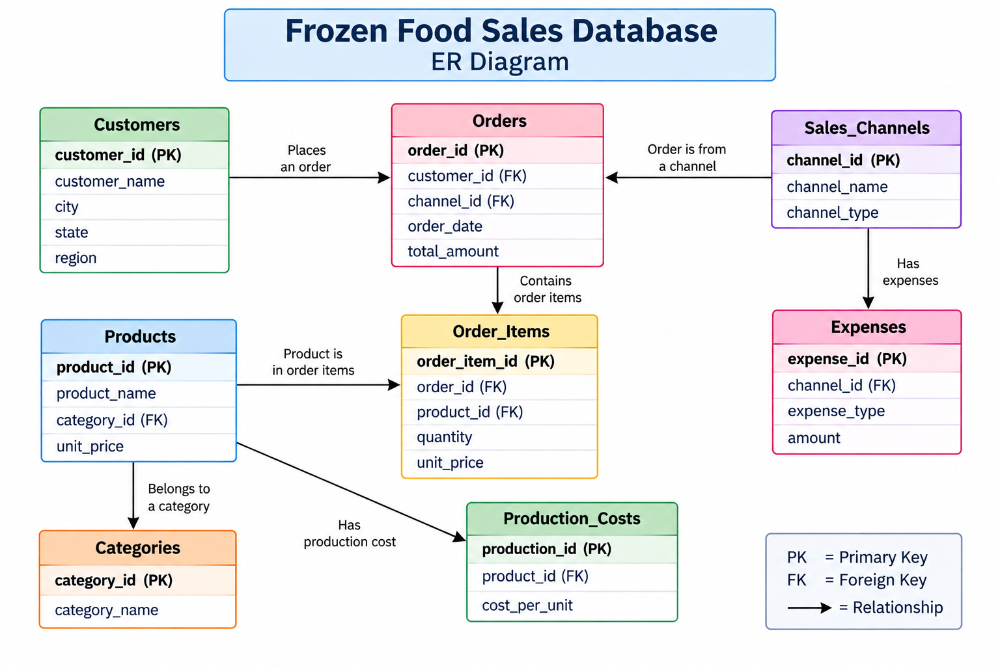

# Frozen Food Business — Sales & Profitability Analysis

## 📌 Project Overview
This project analyzes the sales and profitability performance of a fictional home-based frozen-food business using MySQL.

The analysis focuses on sales performance, product performance, customer behavior, sales channels, production costs, profit margins, and operating expenses.

The objective is to use SQL queries to transform transactional data into meaningful business insights that can support better decision-making.

## 🏠 Business Context

This project simulates a newly started home-based frozen-food business.

The fictional business sells frozen food products through multiple channels, including Instagram, WhatsApp, an online marketplace, and a direct website.
 
## 🎯 Project Objectives

- Analyze overall sales performance and revenue.
- Identify top-performing products and categories.
- Evaluate sales performance across different channels.
- Analyze customer purchasing behavior.
- Calculate production costs and gross profit.
- Compare profit margins across products and categories.
- Analyze operating expenses.
- Identify areas for improving profitability and business performance.

## 🛠️ Tools & Technologies

- MySQL
- SQL
- MySQL Workbench
- GitHub

## 🗄️ Database Structure

The project uses a relational database consisting of 8 interconnected tables.

### 1. Categories

| Column | Data Type | Constraint |
|---|---|---|
| category_id | INT | PRIMARY KEY |
| category_name | VARCHAR(50) | — |

### 2. Products

| Column | Data Type | Constraint |
|---|---|---|
| product_id | INT | PRIMARY KEY |
| product_name | VARCHAR(100) | — |
| category_id | INT | FOREIGN KEY |
| selling_price | DECIMAL(10,2) | — |

### 3. Customers

| Column | Data Type | Constraint |
|---|---|---|
| customer_id | VARCHAR(10) | PRIMARY KEY |
| customer_name | VARCHAR(100) | — |
| city | VARCHAR(50) | — |

### 4. Sales_Channels

| Column | Data Type | Constraint |
|---|---|---|
| channel_id | VARCHAR(10) | PRIMARY KEY |
| channel_name | VARCHAR(50) | — |

### 5. Orders

| Column | Data Type | Constraint |
|---|---|---|
| order_id | VARCHAR(10) | PRIMARY KEY |
| customer_id | VARCHAR(10) | FOREIGN KEY |
| channel_id | VARCHAR(10) | FOREIGN KEY |
| order_date | DATE | — |
| order_status | VARCHAR(20) | — |

### 6. Order_Items

| Column | Data Type | Constraint |
|---|---|---|
| order_item_id | INT | PRIMARY KEY |
| order_id | VARCHAR(10) | FOREIGN KEY |
| product_id | INT | FOREIGN KEY |
| quantity | INT | — |
| unit_price | DECIMAL(10,2) | — |

### 7. Production_Costs

| Column | Data Type | Constraint |
|---|---|---|
| cost_id | INT | PRIMARY KEY |
| product_id | INT | FOREIGN KEY |
| cost_date | DATE | — |
| cost_per_unit | DECIMAL(10,2) | — |

### 8. Expenses

| Column | Data Type | Constraint |
|---|---|---|
| expense_id | INT | PRIMARY KEY |
| expense_date | DATE | — |
| expense_type | VARCHAR(50) | — |
| amount | DECIMAL(10,2) | — |
| channel_id | VARCHAR(10) | FOREIGN KEY |

## 🔗 Table Relationships

The tables are connected using primary keys and foreign keys.

- `Categories` → `Products`
- `Products` → `Order_Items`
- `Products` → `Production_Costs`
- `Customers` → `Orders`
- `Sales_Channels` → `Orders`
- `Orders` → `Order_Items`
- `Sales_Channels` → `Expenses`
- `Sales_Channels` → `Expenses`

These relationships allow the business data to be connected and analyzed using SQL JOINs.
### Entity Relationship Diagram

## 📊 SQL Analysis

The project includes 30+ SQL analysis questions along with advanced CTE-based analysis to evaluate sales performance, customer behavior, product performance, profitability, and business expenses.

The analysis uses SQL techniques such as:

- Aggregate functions (`SUM`, `COUNT`, `AVG`, `MIN`, `MAX`)
- `GROUP BY` and `ORDER BY`
- `JOIN` operations
- `DISTINCT`
- `ROUND`
- `LIMIT`
- Subqueries
- Common Table Expressions (CTEs)
- Date functions
- Calculated fields

## ❓ Business Questions

The SQL analysis was designed to answer the following business questions:

1. What is the total revenue generated by the business?
2. How many orders were placed?
3. How many units were sold?
4. What is the average selling price?
5. Which sales channel generated the highest revenue?
6. Which sales channel has the highest average order value?
7. Which products generated the highest revenue?
8. Which products sold the highest number of units?
9. Which product categories generated the highest revenue?
10. Which product categories have the highest profit margin?
11. Who are the top customers based on revenue?
12. Which customers placed the most orders?
13. What is the total production cost?
14. What is the gross profit?
15. What is the overall gross profit margin?
16. Which products generate the highest gross profit?
17. Which months generated the highest revenue?
18. What are the major operating expenses?
19. Which expense category has the highest cost?
20. What is the total operating expense?
21. What is the net profit or loss?
22. What is the order status distribution?
23. Which sales channels have the strongest performance?
24. Which products contribute most to overall profitability?
25. Which product categories provide better margins?

## 🔍 Key Findings & Insights

The SQL analysis produced the following key business insights:

| Finding                  |              Exact Value |
| ------------------------ | -----------------------: |
| Total Revenue            |                  ₹93,780 |
| Units Sold               |                      309 |
| Orders                   |                       70 |
| Gross Profit             |                  ₹35,150 |
| Gross Margin             |                   37.48% |
| Operating Expenses       |                  ₹36,950 |
| Net Profit/Loss          |              **-₹1,800** |
| Best Channel Revenue     | Direct Website – ₹28,920 |
| Best Product Revenue     |  Chicken Curry – ₹13,200 |
| Highest Category Revenue |  Frozen Snacks – ₹33,380 |
| Highest Profit Margin    |  Frozen Breads – 44.44%  |
| Highest Expense          |    Electricity – ₹12,150 |
| Best Month               |          April – ₹21,840 |

## ⚠️ Assumptions & Limitations

- The dataset is fictional and created for educational and portfolio purposes.
- The analysis is based on the available transactional data from January to May 2026.
## 👩‍💻 Author

**Naseeha Farzana**

Aspiring Data Analyst | SQL | Python | Excel | Power BI

This project was created as part of my data analytics portfolio to demonstrate SQL, database management, data analysis, and business problem-solving skills.
